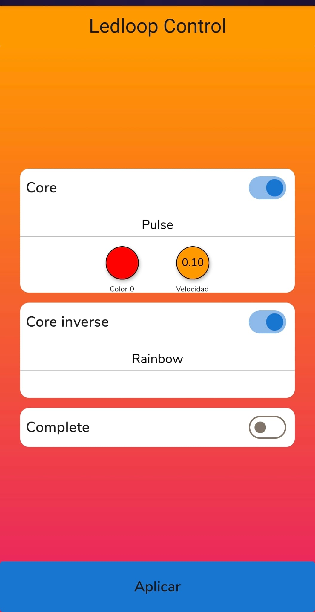
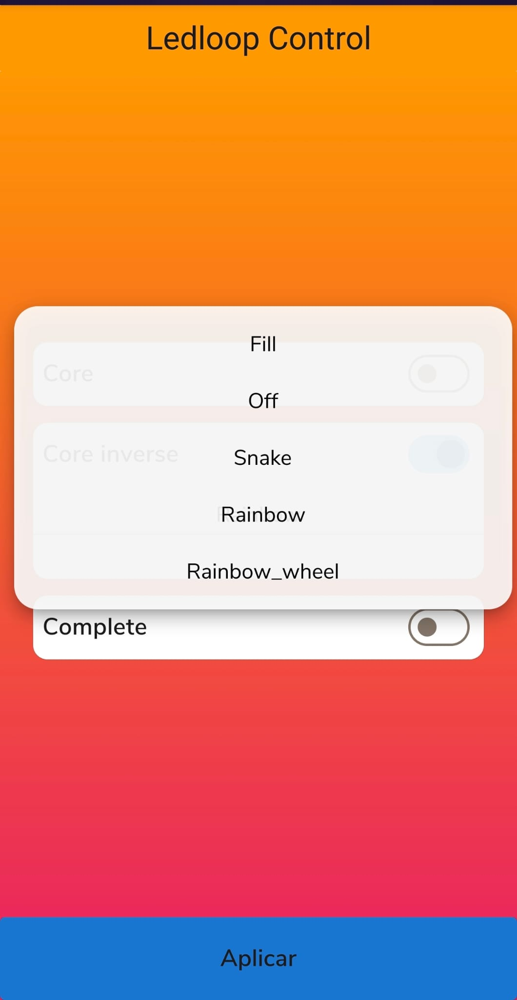
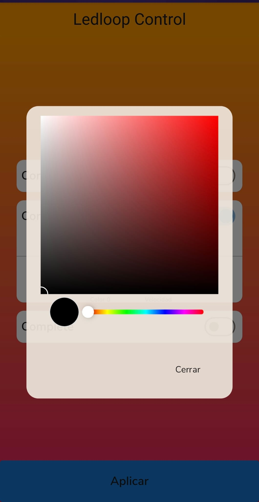
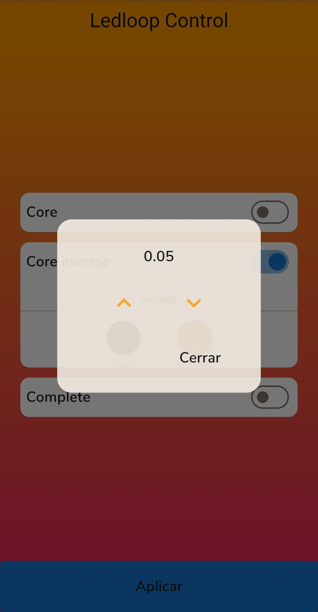

# Ews_ledloop

This is a Led Strip Controller App written in Flutter. It is mainly focused on being the embedded web service (EWS), but it can also work as an Android or desktop app.

This repo is part of **The Ledloop Project**, a bigger project you can find here: https://github.com/Gmatarrubia/ledloop-yocto

For further information go there.

## Screenshots

  
  

  
  

